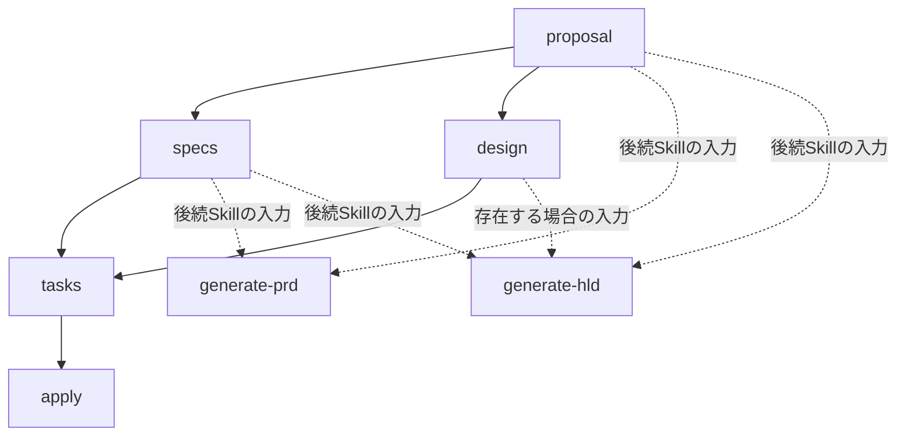
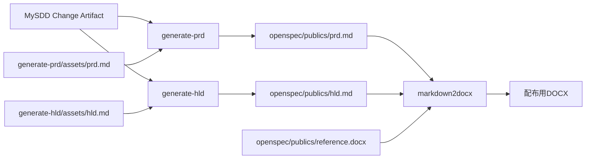

# MySDD カスタムSchema仕様

## 目次

- [1. 概要](#1-概要)
- [2. 目的と対象範囲](#2-目的と対象範囲)
- [3. 追加観点](#3-追加観点)
  - [3.1 ISO/IEC/IEEE 12207](#31-isoiecieee-12207)
  - [3.2 ISO/IEC 25010](#32-isoiec-25010)
- [4. spec-drivenからの変更](#4-spec-drivenからの変更)
- [5. 想定ディレクトリ構成](#5-想定ディレクトリ構成)
- [6. Config設定](#6-config設定openspecconfigyaml)
- [7. Schema定義](#7-schema定義openspecschemasmysddschemayaml)
  - [7.1 Artifactモデル](#71-artifactモデル)
  - [7.2 schema.yaml変更例](#72-schemayaml変更例)
- [8. Template仕様](#8-template仕様)
  - [8.1 proposal.md](#81-proposalmd)
  - [8.2 spec.md](#82-specmd)
  - [8.3 design.md](#83-designmd)
  - [8.4 tasks.md](#84-tasksmd)
- [9. Agent Skills](#9-agent-skills)
  - [9.1 generate-prd](#91-generate-prd)
  - [9.2 generate-hld](#92-generate-hld)
  - [9.3 `markdown2docx`](#93-markdown2docx)
  - [9.4 `openspec-git-workflow`](#94-openspec-git-workflow)
- [10. 運用・保守手順](#10-運用保守手順)
- [11. 受け入れ条件](#11-受け入れ条件)
- [References](#references)

## 1. 概要

MySDDは、OpenSpecの組み込みSchema `spec-driven`をForkし、
ISO/IEC/IEEE 12207のソフトウェアライフサイクル観点と、
ISO/IEC 25010の製品品質観点を組み込むカスタムSchemaである。
表示名は「MySDD」、機械識別子は`mysdd`とする。

| 項目 | 定義 |
| --- | --- |
| Status | Implemented |
| Base Schema | `spec-driven` |
| Custom Schema | `mysdd` |
| Standards baseline | ISO/IEC/IEEE 12207:2026、ISO/IEC 25010:2023 |
| OpenSpecの正本 | `proposal`、`specs`、`design`、`tasks` |
| 正式文書の正本 | Markdown |
| 配布形式 | DOCX |

本仕様は、規格の観点をProjectの開発手順へ割り当てるTailoringである。
ISO認証、規格への完全適合、または規格本文の代替を意味しない。

## 2. 目的と対象範囲

MySDDの目的は、`spec-driven`との互換性を維持しながら、Changeの計画、
実装、検証および保守でライフサイクルと品質を追跡可能にすることである。

対象範囲は次のとおりとする。

- 標準4 ArtifactへISO/IEC/IEEE 12207とISO/IEC 25010の観点を追加する
- Requirement、Scenario、設計判断、Task、Evidenceを追跡可能にする
- `generate-prd`で要件定義書、`generate-hld`で基本設計書を別途生成する
- `markdown2docx`で正本Markdownから配布用DOCXを再生成可能にする
- `openspec-git-workflow`でOpenSpecの各Phaseを独立したcommitにする
- MySDDの設定、Schema、Template、Skillおよび保守方法を本書へ集約する

次は対象外とする。

- Delta Spec構文、Sync、ArchiveおよびApplyの基本動作の変更
- `prd`または`hld`をOpenSpec Artifact Graphへ追加すること
- `/opsx:propose`による要件定義書または基本設計書の生成
- 入力Artifactにない要求、設計または検証結果の推測補完
- DOCXからMarkdownまたはOpenSpec Artifactへの逆同期
- 規格本文の複製と、Schema導入だけによる適合宣言

OpenSpecの通常運用は[MySDDワークフロー](MySDD-Workflow.md)を参照する。

## 3. 追加観点

MySDDは標準4 Artifactの構造を変えず、各Artifactの`instruction`と
Templateへ次の観点を追加する。適用しない観点は、理由を記録する。

### 3.1 ISO/IEC/IEEE 12207

ISO/IEC/IEEE 12207のソフトウェアライフサイクル観点を、Change単位で
次のようにTailoringする。

<!-- markdownlint-disable MD013 -->
| Artifact／操作 | 追加する観点 | 主な記録内容 |
| --- | --- | --- |
| `proposal` | ステークホルダ、移行、運用、保守、廃止への影響 | 対象者、影響範囲、前提、対象外理由 |
| `specs` | ステークホルダ要求、ソフトウェア要求 | 検証可能なRequirementとScenario |
| `design` | Architecture、Integration、移行、運用、保守 | 構成、Interface、代替案、Rollback |
| `tasks` | 実装、統合、検証、妥当性確認、構成管理 | 作業、完了条件、Evidence |
| `verify` | 完全性、正しさ、一貫性、品質保証 | 検証結果、残余Risk、Evidence |
| `archive` | 構成管理、知識保持 | Main Spec、監査可能なChange履歴 |
<!-- markdownlint-enable MD013 -->

すべてのChangeへ全観点を機械的に要求しない。Changeに該当しない観点は、
「対象外」と判断理由を`proposal.md`へ記録する。

### 3.2 ISO/IEC 25010

ISO/IEC 25010:2023のProduct Quality Modelが定義する9特性を、
品質要求を分類するための共通語彙として使用する。

1. 機能適合性（Functional suitability）
2. 性能効率性（Performance efficiency）
3. 互換性（Compatibility）
4. インタラクション能力（Interaction capability）
5. 信頼性（Reliability）
6. セキュリティ（Security）
7. 保守性（Maintainability）
8. 柔軟性（Flexibility）
9. 安全性（Safety）

各Changeでは9特性の適用可否を`proposal.md`で判断する。適用する品質要求は、
Delta Specへ次の情報を記録し、`design.md`、`tasks.md`およびEvidenceまで
追跡する。適用しない特性には理由を記録する。

<!-- markdownlint-disable MD013 -->
| ID | 品質特性 | 品質要求 | Measure | Target | Conditions | Verification Method | 参照元 |
| --- | --- | --- | --- | --- | --- | --- | --- |
| `QR-001` | `<characteristic>` | `<requirement>` | `<measure>` | `<value>` | `<environment>` | `<test>` | `<requirement-id>` |
<!-- markdownlint-enable MD013 -->

## 4. `spec-driven`からの変更

MySDDはFork元との互換性を優先し、Artifactの数、ID、依存関係、出力先、
Delta Spec構文を変更しない。変更点は次のとおりとする。

<!-- markdownlint-disable MD013 -->
| 対象 | `spec-driven` | MySDDでの変更 |
| --- | --- | --- |
| `openspec/config.yaml` | SchemaはProjectで選択 | `schema: mysdd`を設定する |
| `schema.yaml` | 標準4 Artifactを定義 | Forkし、各`instruction`へ第3章の観点を追加する |
| OpenSpec Template | 標準の章立て | 標準構造を保ち、ライフサイクル、品質、Evidenceの記入欄を追加する |
| `/opsx:propose` | 標準4 Artifactを生成 | ISO観点を含む4 Artifactだけを生成する |
| Apply開始条件 | `tasks` | `tasks`のまま維持する |
| 正式文書 | 対象外 | `generate-prd`と`generate-hld`がOpenSpec外の後続処理として生成する |
| DOCX変換 | 対象外 | `markdown2docx`が正本MarkdownをDOCXへ変換する |
| Phaseごとのcommit | 対象外 | `openspec-git-workflow`が既存Workflowの成功結果だけをcommitする |
| `docs/references/MySDD-Spec.md` | 存在しない | 本ファイルを修正し、設定、Schema、Template、Skill、運用、受け入れ条件の正本とする |
<!-- markdownlint-enable MD013 -->

`generate-prd/assets/prd.md`と`generate-hld/assets/hld.md`はOpenSpec
Templateではない。これらは各Agent Skillが所有する正式文書用の
Template Assetであり、
`/opsx:propose`およびOpenSpecのArtifact解決には使用しない。

## 5. 想定ディレクトリ構成

各行は`# [分類] 簡単な説明`の形式で、実施する変更を示す。

- `[修正]`: 既存ファイルの内容を変更する
- `[追加]`: 新しいファイルまたはディレクトリを追加する
- `[移動]`: 既存ファイルを別の場所へ移す
- `[維持]`: 既存実装を変更せず利用する
- `[生成]`: OpenSpec操作またはAgent Skillが生成する
- `[除外]`: 生成するがGit管理対象外とする

```bash
# [+] 追加
# [-] 削除
# [~] 修正
# [→] 移動
# [!] 管理対象外
# 🤖 AI生成
openspec/
├─ config.yaml                              # [~] カスタム Schema を指定.
│
├─ schemas/
│  └─ mysdd/                                # ... spec-driven を fork する.
│     ├─ schema.yaml                        # [+] カスタム Schema(日本語).
│     └─ templates/                         # ... OpenSpec Templates(English).
│        ├─ proposal.md                     # [+] 計画時のISO観点を追加.
│        ├─ spec.md                         # [+] 測定可能な品質要求を追加.
│        ├─ design.md                       # [+] 品質・運用設計欄を追加.
│        └─ tasks.md                        # [+] 検証の証跡を追加.
│
├─ publics/                                 # ... 生成物格納場所(日本語).
│  ├─ .gitignore                            # [+] gitignore.
│  ├─ reference.docx                        # [+] DOCXの共通書式.
│  ├─ prd.md                                # [+] generate-prd スキルが作る要件定義書. 🤖
│  ├─ hld.md                                # [+] generate-hld スキルが作る基本設計書. 🤖
│  ├─ prd.docx                              # [!] generate-prdが作る配布用要件定義書. 🤖
│  └─ hld.docx                              # [!] generate-hldが作る配布用基本設計書. 🤖
│
└─ changes/<change-name>/                   # ... 生成物格納場所(English).
   ├─ .openspec.yaml                        # [+] Schema選択情報 🤖
   ├─ proposal.md                           # [+] 変更提案 🤖
   ├─ specs/<capability>/spec.md            # [+] Delta Spec 🤖
   ├─ design.md                             # [+] 技術設計 🤖
   └─ tasks.md                              # [+] 実装Task 🤖

.agents/skills/                             # ... Agent Skills 格納場所(日本語).
├─ .gitignore                               # [+] 対象の4スキル以外を管理対象外にする.
├─ markdown2docx/
│  └─ SKILL.md                              # [+] Markdown を Docx に変換するスキル.
├─ generate-prd/
│  ├─ SKILL.md                              # [+] 要件定義書 を作るスキル.
│  └─ assets/prd.md                         # [+] 要件定義書テンプレート.
├─ generate-hld/
│  ├─ SKILL.md                              # [+] 基本設計書 を作るスキル.
│  └─ assets/hld.md                         # [+] 基本設計書テンプレート.
└─ openspec-git-workflow/
   └─ SKILL.md                              # [+] OpenSpec処理後のcommitを作るスキル.
```

Schemaが参照するTemplateは`openspec/schemas/mysdd/templates/`の4ファイル
だけである。`prd.md`と`hld.md`は第9章で定義するAgent SkillのAssetである。

## 6. Config設定（`openspec/config.yaml`）

Projectの既定Schemaを`mysdd`へ変更する。

```yaml
schema: mysdd
```

Project固有の技術構成、規約およびDomain知識は`context`へ記載できる。
Artifact固有の補足は`rules`、ApplyやArchiveの運用上の補足は
`operations`へ記載する。ISO観点の共通ルールはConfigへ重複させず、
SchemaとTemplateを正本とする。PhaseごとのGit操作もConfigへ記載せず、
`openspec-git-workflow`だけが所有する。

期待結果は、新規Changeが明示的な上書きなしに`mysdd`を使用することである。
`openspec instructions`が別Schemaを返す場合は設定失敗と判断する。

## 7. Schema定義（`openspec/schemas/mysdd/schema.yaml`）

### 7.1 Artifactモデル

MySDDは`spec-driven`と同じ4 Artifactだけを定義する。



| ID | 出力 | 必須依存 | 完了条件 |
| --- | --- | --- | --- |
| `proposal` | `proposal.md` | なし | 変更理由、Capability、影響がある |
| `specs` | `specs/**/*.md` | `proposal` | RequirementとScenarioがある |
| `design` | `design.md` | `proposal` | 方式、判断理由、Riskがある |
| `tasks` | `tasks.md` | `specs`、`design` | 作業とEvidenceが追跡できる |

`apply.requires`は`[tasks]`、`apply.tracks`は`tasks.md`とする。
`prd`、`hld`、`markdown2docx`および`openspec-git-workflow`は
Artifact Graphへ追加しない。

### 7.2 `schema.yaml`変更例

Fork元のID、出力先および依存関係を維持し、各`instruction`にだけ
ISO観点を追加する。次は変更箇所を示す要約例であり、実ファイルでは
Fork元の既存指示も維持する。

```yaml
name: mysdd
version: 1
description: >-
  ISOライフサイクルおよび製品品質の観点を追加したspec-drivenのMySDD Fork

artifacts:
  - id: proposal
    generates: proposal.md
    template: proposal.md
    instruction: |
      適用可能なISO/IEC/IEEE 12207ライフサイクル影響を記録する。
      ISO/IEC 25010のすべての製品品質特性を確認する。
      適用しない観点には理由を記録する。
      要件定義書および基本設計書は生成しない。
    requires: []

  - id: specs
    generates: "specs/**/*.md"
    template: spec.md
    instruction: |
      検証可能なRequirementとScenarioを定義する。
      適用する品質要求ごとに、品質ID、特性、測定量、目標値、条件および
      検証方法を記録する。
    requires: [proposal]

  - id: design
    generates: design.md
    template: design.md
    instruction: |
      品質IDを設計判断、Trade-offおよびEvidenceへ対応付ける。
      適用可能な移行、運用、保守および廃止を扱う。
    requires: [proposal]

  - id: tasks
    generates: tasks.md
    template: tasks.md
    instruction: |
      実装、統合、検証およびEvidenceのTaskを含める。
    requires: [specs, design]

apply:
  requires: [tasks]
  tracks: tasks.md
```

## 8. Template仕様

本章の4ファイルだけがOpenSpec Templateである。Fork元が解析する見出し、
Delta操作およびTaskのチェックボックス形式を維持し、記入欄を追加する。

### 8.1 `proposal.md`

変更の必要性、Capabilityおよび影響に加え、計画段階のISO観点を記録する。
ここでは観点と適用可否を整理するだけで、PRDまたはHLDを生成しない。

```markdown
## Why
## What Changes
## Capabilities
### New Capabilities
### Modified Capabilities
## Impact
## Stakeholders and Lifecycle Impact
<!-- 利用者、移行、運用、保守、廃止への影響と対象外理由を記録する。 -->
## Quality Considerations
<!-- 適用品質特性、測定目標、条件、検証方法を記録する。 -->
```

### 8.2 `spec.md`

OpenSpecが解析する見出しと階層を変更しない。RequirementはSHALLまたは
MUST、ScenarioはWHEN／THENで記述する。品質要求にはQuality ID、特性、
Measure、Target、ConditionsおよびVerification Methodを含める。

```markdown
## Purpose

## ADDED Requirements

### Requirement: <name>

<system SHALL ...>

#### Scenario: <name>

- **WHEN** <condition>
- **THEN** <observable result>
```

`Purpose`は新規Capabilityだけに使用する。既存Capabilityの変更では、
Fork元のDelta Spec規則に従う。

### 8.3 `design.md`

標準の設計判断に、品質特性とライフサイクルの実現方式を追加する。

```markdown
## Context
## Goals / Non-Goals
## Decisions
## Quality Attribute Design
<!-- Quality ID、設計方式、Trade-off、検証方法を対応付ける。 -->
## Lifecycle, Migration and Operations
<!-- 移行、Rollback、運用、保守、廃止を記載する。 -->
## Risks / Trade-offs
## Migration Plan
## Open Questions
```

### 8.4 `tasks.md`

OpenSpec Applyが追跡できる形式を維持し、適用する品質目標と
ライフサイクル影響の完了Evidenceを各Taskへ含める。

```markdown
## 1. <Task Group>

- [ ] 1.1 <実装内容>を行い、<テストまたはEvidence>で完了を確認する
```

## 9. Agent Skills

正式文書の生成とPhase単位のGit commitはOpenSpec Templateから分離し、
4つのAgent Skillsで扱う。



### 9.1 `generate-prd`

`generate-prd`はMySDD Changeから要件定義書を生成するAgent Skillである。

- Interface: `change-name`だけを受け取る
- 入力: `proposal.md`、1件以上の`specs/**/*.md`
- Template Asset: `.agents/skills/generate-prd/assets/prd.md`
- 出力: `openspec/publics/prd.md`、`openspec/publics/prd.docx`
- 完了条件: 全章があり、要求と検証方法の参照関係を保持している
- 失敗条件: 必須入力がない、または入力にない情報を確定事項として補完した

`assets/prd.md`は要件定義書の章立てを定めるSkill専用Assetであり、
OpenSpec Templateではない。Markdown生成後のDOCX変換は
`markdown2docx`へ委譲する。

### 9.2 `generate-hld`

`generate-hld`はMySDD Changeから基本設計書を生成するAgent Skillである。

- Interface: `change-name`だけを受け取る
- 入力: `proposal.md`、1件以上の`specs/**/*.md`、存在する`design.md`
- Template Asset: `.agents/skills/generate-hld/assets/hld.md`
- 出力: `openspec/publics/hld.md`、`openspec/publics/hld.docx`
- 完了条件: 全章があり、要求、設計、検証の参照関係を保持している
- 失敗条件: 必須入力がない、または入力にない情報を確定事項として補完した

`design.md`がない場合、設計固有の未確定事項は`TBD`とする。
`assets/hld.md`もSkill専用Assetであり、OpenSpec Templateではない。
Markdown生成後のDOCX変換は`markdown2docx`へ委譲する。

### 9.3 `markdown2docx`

`markdown2docx`は正本Markdownを同名のDOCXへ変換する共通Agent Skillである。
`generate-prd`と`generate-hld`から利用し、文書内容の生成や補完は担当しない。

- 入力: `openspec/publics/`配下の変換元Markdown
- 参照書式: `openspec/publics/reference.docx`
- 実行処理: `SKILL.md`に定義したmise管理のPandocコマンド
- 出力: 入力Markdownと同じ場所にある同名のDOCX
- 完了条件: 非ゼロサイズのDOCXが生成され、入力Hashが変化していない
- 失敗時: 正本Markdownを保持し、部分成功と失敗理由を呼び出し元へ返す

DOCX変換責務は`markdown2docx/`へ集約する。`SKILL.md`が入出力契約と
Pandoc実行手順を所有し、専用Scriptは置かない。文書生成Skillには、
それぞれの入力解釈とMarkdown生成だけを持たせる。

### 9.4 `openspec-git-workflow`

`openspec-git-workflow`はOpenSpecの`propose`、`apply`、`verify`、
`archive`実行後にGit commitを作成する共通Agent Skillである。各処理自体は
再実装せず、既存のOpenSpec Workflowを呼び出し、その前後のGit操作だけを
担当する。

- 入力: OpenSpec phase（`propose` / `apply` / `verify` / `archive`）、change名
- 事前処理: 実行前のGit working tree状態を記録する
- 実行処理: 対応するWorkflowを実行し、成功後に今回の変更だけをstageする
- commit形式: PhaseとChange名からRepository規約準拠のMessageを生成する
- `verify`時: ファイル変更がない場合は`--allow-empty`でcommitする
- 完了条件: Workflowが正常終了し、対応するGit commitが作成される
- 失敗時: commitせず、既存の未commit変更を保持して失敗理由を返す

Git commit責務は`openspec-git-workflow/`へ集約する。`SKILL.md`がphaseごとの実行契約、
stage対象、commit条件を所有する。OpenSpec側のschema、template、configにはGit操作を持たせず、
`propose`、`apply`、`verify`、`archive`の各処理は既存のOpenSpec workflowへ委譲する。

また、実行前から存在する未commit変更をcommitへ混在させず、今回のPhaseで
発生した変更だけを対象とする。自動`push`、既存commitの`amend`、
Historyの書き換えおよび競合状態でのcommitは行わない。

## 10. 運用・保守手順

### 10.1 検証手順

Schema、Template、Change、DOCX変換、文書Lintの順で検証する。

<!-- markdownlint-disable MD013 -->

```powershell
# このPowerShellセッションでmise管理のToolを有効化する。
(&mise activate pwsh) | Out-String | Invoke-Expression

# MySDDのSchema構造、Template参照、依存関係を検証する。
openspec schema validate mysdd --verbose

# Artifactごとに解決されるOpenSpec Templateを確認する。
openspec templates --schema mysdd --json

# 対象ChangeとDelta Specを厳格に検証する。
openspec validate '<change-name>' --strict

# 4つのProject固有SkillだけがGit管理対象になることを確認する。
git check-ignore -v '.agents/skills/openspec-propose/SKILL.md'

# PRDをmise管理のPandocで共通書式のDOCXへ変換できることを確認する。
mise exec pandoc@3.11 --command "pandoc 'openspec/publics/prd.md' --from=gfm --to=docx --reference-doc='openspec/publics/reference.docx' --output='openspec/publics/prd.docx'"

# HLDをmise管理のPandocで共通書式のDOCXへ変換できることを確認する。
mise exec pandoc@3.11 --command "pandoc 'openspec/publics/hld.md' --from=gfm --to=docx --reference-doc='openspec/publics/reference.docx' --output='openspec/publics/hld.docx'"

# MySDD仕様書のMarkdown形式を検証する。
npx --yes markdownlint-cli2 'docs/references/MySDD-Spec.md'
```

<!-- markdownlint-enable MD013 -->

期待結果は、SchemaとChangeのValidation、DOCX変換、Markdownlintがすべて
成功し、OpenSpecが解決するTemplateが第8章の4ファイルだけになり、
Git管理対象のProject固有Skillが第9章の4件だけになることである。

次のいずれかに該当する場合は失敗とし、ApplyまたはArchiveへ進まない。

- Schema名、Artifact ID、依存関係またはTemplate参照が解決できない
- Delta Spec構文またはChangeの厳格Validationに失敗する
- `prd.md`または`hld.md`がOpenSpec Artifactとして解決される
- DOCXを再生成できない、またはMarkdownlintに失敗する

### 10.2 Fork元の更新取り込み

1. `spec-driven`の`schema.yaml`と4 Templateの変更を確認する。
2. Artifact ID、依存関係、Delta Spec構文の互換変更をMySDDへ反映する。
3. 第3章のISO観点と、第9章のSkill責務が維持されていることを確認する。
4. 第10.1節の検証をすべて実行する。
5. 実装と本仕様の差分を同じ変更で更新する。

`prd.md`と`hld.md`の章立て変更は、それぞれのSkill Assetだけへ反映する。
OpenSpec Templateへ複製しない。

### 10.3 Rollback

更新が検証に失敗した場合は、失敗した変更だけを直前の動作版へ戻す。
生成済みの正本MarkdownとChange Artifactは保持し、DOCXは動作版の
`markdown2docx`で再生成する。Schemaを`spec-driven`へ一時的に戻す場合は、
MySDD固有のISO観点が適用されないことを利用者へ明示する。

## 11. 受け入れ条件

- `mysdd`が`spec-driven`の4 Artifactを互換のまま維持している
- `/opsx:propose`がISO観点を反映した4 Artifactだけを生成する
- `proposal.md`が12207と25010の適用可否および対象外理由を記録できる
- 品質要求をMeasure、Target、Verification Method、Evidenceまで追跡できる
- Apply開始条件が`tasks`だけである
- `generate-prd`が固有Assetから`openspec/publics/prd.md`とDOCXを生成できる
- `generate-hld`が固有Assetから`openspec/publics/hld.md`とDOCXを生成できる
- `markdown2docx`が文書内容を変更せずPandoc変換を共通化している
- `openspec-git-workflow`が成功したPhaseの変更だけをcommitできる
- `prd.md`と`hld.md`がOpenSpec TemplateまたはArtifactとして扱われない
- 入力にない情報が補完されず、未確定事項が`TBD`または対象外になる
- Markdownだけが正本としてGit管理され、DOCXを再生成できる
- `.agents/skills/`では第9章の4 SkillだけがGit管理される
- 本書がMySDDの設定、Schema、Template、Skill、運用の正本になっている

## References

- [OpenSpec Customization](https://github.com/Fission-AI/OpenSpec/blob/main/docs/customization.md)
- [Built-in spec-driven schema](https://github.com/Fission-AI/OpenSpec/blob/main/schemas/spec-driven/schema.yaml)
- [ISO/IEC/IEEE 12207:2026](https://www.iso.org/standard/90219.html)
- [ISO/IEC 25010:2023](https://www.iso.org/standard/78176.html)
- [Agent Skills Specification](https://agentskills.io/specification)
