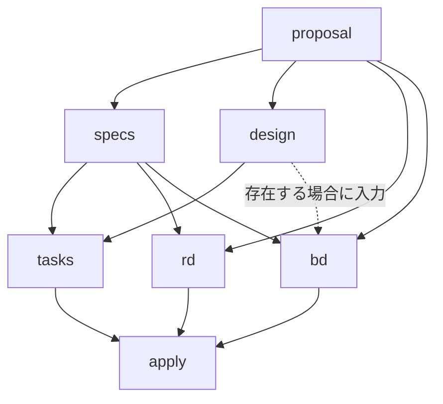

# MySDD カスタムSchema仕様

## 1. 文書概要

MySDDは、OpenSpecの組み込み`spec-driven`をForkしたProject固有Schemaである。表示名は「MySDD」、Schemaの機械識別子は`mysdd`とする。

| 項目 | 定義 |
| --- | --- |
| Status | Proposed |
| Base schema | `spec-driven` |
| Custom schema | `mysdd` |
| Standards baseline | ISO/IEC/IEEE 12207:2026、ISO/IEC 25010:2023 |
| 正本形式 | Markdown |
| 配布形式 | DOCX |

本仕様は、規格の観点をChangeの成果物へ割り当てるTailoringである。ISO認証、完全適合、または規格本文の代替を意味しない。

## 2. 目的と対象外

MySDDは`spec-driven`の軽量なChange管理を保ったまま、次を追加する。

- Change単位の要件定義書`rd`と基本設計書`bd`
- Requirement、Scenario、設計判断、Task、検証Evidenceのトレーサビリティ
- ISO/IEC/IEEE 12207のライフサイクル観点
- ISO/IEC 25010の測定可能なProduct Quality要求
- Markdownから再生成できるDOCX

次は対象外とする。

- Delta Spec構文、Sync、Archiveの仕様変更
- Artifactにない要求または設計の推測補完
- DOCXからMarkdownまたはOpenSpec Artifactへの逆同期
- ISO規格本文の複製と、Schema導入だけによる適合宣言

## 3. `spec-driven`からの変更

| 項目 | `spec-driven` | `mysdd` |
| --- | --- | --- |
| 標準Artifact | `proposal`、`specs`、`design`、`tasks` | 4つを互換のまま維持 |
| 追加Artifact | なし | `rd`、`bd` |
| Apply開始条件 | `tasks` | `tasks`、`rd`、`bd` |
| 正式文書 | なし | `docs/rd.md`、`docs/bd.md` |
| 配布文書 | なし | Markdownから生成する同名DOCX |
| ライフサイクル | Project任意 | 12207観点をArtifactとVerifyへ割り当て |
| 品質モデル | Project任意 | 25010の適用特性と検証Evidenceを追跡 |
| Agent Skill | OpenSpec標準Skill | `gen-pd`、`gen-bd`を追加 |

OpenSpecとの互換性を保つため、標準4 ArtifactのID、出力先、Delta Specの見出し、RequirementとScenarioの構文は変更しない。

## 4. 目標ディレクトリ構成

各ファイル名の末尾に、`spec-driven`と現行Repositoryを基準とした変更種別を付す。

- `[ADD]`: 新規追加
- `[MOD]`: 既存ファイルを変更
- `[MOVE]`: 既存ファイルを移動
- `[KEEP]`: 既存実装をそのまま利用
- `[GEN]`: Changeの操作またはSkillが生成
- `[IGNORE]`: 生成するがGit管理外
- `[DELETE]`: 統合後に削除

```text
openspec/
├─ config.yaml                                      [MOD]
├─ schemas/
│  └─ mysdd/
│     ├─ schema.yaml                                [ADD]
│     └─ templates/
│        ├─ proposal.md                              [ADD][MOD]
│        ├─ spec.md                                  [ADD][KEEP]
│        ├─ design.md                                [ADD][MOD]
│        ├─ tasks.md                                 [ADD][MOD]
│        ├─ rd.md                                    [ADD]
│        └─ bd.md                                    [ADD]
├─ document-templates/
│  └─ reference.docx                               [MOVE]
└─ changes/<change-name>/
   ├─ .openspec.yaml                                 [GEN]
   ├─ proposal.md                                    [GEN]
   ├─ specs/<capability>/spec.md                      [GEN]
   ├─ design.md                                      [GEN]
   ├─ tasks.md                                       [GEN]
   └─ docs/
      ├─ rd.md                                        [GEN]
      ├─ rd.docx                                      [GEN][IGNORE]
      ├─ bd.md                                        [GEN]
      └─ bd.docx                                      [GEN][IGNORE]

.agents/skills/
├─ _shared/document-generation.md                    [KEEP]
├─ gen-pd/SKILL.md                                   [ADD]
└─ gen-bd/SKILL.md                                   [ADD]

scripts/openspec/
├─ render-docx.ps1                                   [KEEP]
└─ test-render-docx.ps1                              [KEEP]

docs/
├─ references/
│  ├─ OpenSpec-Workflow.md                          [KEEP]
│  ├─ MySDD-Workflow.md                            [ADD]
│  ├─ MySDD-Spec.md                                [ADD]
│  ├─ workflow.md                                  [DELETE]
│  └─ customization.md                             [DELETE]
└─ plan/
   └─ customization-implementation-plan.md           [DELETE]

AGENTS.md                                                 [MOD]
README.md                                                 [MOD]
```

`openspec/templates/reference.docx`は`openspec/document-templates/reference.docx`へ移動する。以降、Skillと検証Scriptは移動後のパスだけを参照する。

## 5. Artifactモデル



| ID | 出力 | 必須依存 | 完了条件 |
| --- | --- | --- | --- |
| `proposal` | `proposal.md` | なし | 変更理由、Capability、影響範囲がある |
| `specs` | `specs/**/*.md` | `proposal` | 検証可能なRequirementとScenarioがある |
| `design` | `design.md` | `proposal` | 方式、判断理由、Riskがある |
| `tasks` | `tasks.md` | `specs`、`design` | 実装と完了Evidenceが追跡できる |
| `rd` | `docs/rd.md` | `proposal`、`specs` | `gen-pd`が要件定義書とDOCXを生成する |
| `bd` | `docs/bd.md` | `proposal`、`specs` | `gen-bd`が基本設計書とDOCXを生成する |

`apply.requires`は`[tasks, rd, bd]`、`apply.tracks`は`tasks.md`とする。`design.md`がない場合、`gen-bd`は設計固有の未確定項目を`TBD`とする。

## 6. ISO/IEC/IEEE 12207の取り込み

ISO/IEC/IEEE 12207:2026のソフトウェアライフサイクル観点を、OpenSpecの反復的なChangeフローへ次のようにTailoringする。

| Artifact／工程 | 取り込む観点 | 記録内容 |
| --- | --- | --- |
| `proposal` | ステークホルダ、移行、運用、保守、廃止への影響 | 対象者、影響範囲、前提 |
| `specs` | ステークホルダ要求とソフトウェア要求 | 検証可能なRequirementとScenario |
| `rd` | 要求定義、制約、Interface、受入、追跡 | 要求ID、根拠、受入条件、検証方法 |
| `design`・`bd` | Architecture、Integration、移行、運用、保守 | 構成、Interface、代替案、Rollback |
| `tasks` | 実装、統合、検証、妥当性確認、構成管理 | Taskと完了Evidence |
| `verify` | 完全性、正しさ、一貫性、品質保証 | 検証結果、残余Risk、Evidence |
| `archive` | 構成管理と知識保持 | Main Specと監査可能なChange履歴 |

すべてのChangeにすべての観点を機械的に要求しない。適用しない観点は「対象外」と理由を記録する。

## 7. ISO/IEC 25010の取り込み

ISO/IEC 25010:2023のProduct Quality Modelが定義する9特性を、品質要求の分類語に使う。

1. 機能適合性（Functional suitability）
2. 性能効率性（Performance efficiency）
3. 互換性（Compatibility）
4. インタラクション能力（Interaction capability）
5. 信頼性（Reliability）
6. セキュリティ（Security）
7. 保守性（Maintainability）
8. 柔軟性（Flexibility）
9. 安全性（Safety）

各Changeは9特性をレビューし、適用する品質要求を`rd.md`に次の形で記録する。非適用の特性は理由を残す。

<!-- markdownlint-disable MD013 -->
| ID | 品質特性 | 品質要求 | Measure | Target | Conditions | Verification Method | 参照元 |
| --- | --- | --- | --- | --- | --- | --- | --- |
| `QR-001` | `<characteristic>` | `<requirement>` | `<measure>` | `<value>` | `<environment>` | `<test>` | `<requirement-id>` |
<!-- markdownlint-enable MD013 -->

`bd.md`はQuality IDに設計方式、影響Component、監視、Evidenceを対応付ける。
`tasks.md`はTargetを確認するテスト、分析、レビューを含める。
VerifyはQuality IDからEvidenceまで追跡する。

## 8. Template仕様

### 8.1 `proposal.md`

標準見出しを保ち、ステークホルダとライフサイクル影響を追加する。

```markdown
## Why
## What Changes
## Capabilities
### New Capabilities
### Modified Capabilities
## Impact
## Stakeholders and Lifecycle Impact
<!-- 利用者、移行、運用、保守、廃止への影響を記載する。 -->
```

### 8.2 `spec.md`

OpenSpecが解析する見出しと階層を変更しない。新規Capabilityだけ`Purpose`を持ち、RequirementはSHALLまたはMUST、ScenarioはWHEN／THENで記述する。

```markdown
## Purpose
## ADDED Requirements
### Requirement: <name>
<system SHALL ...>
#### Scenario: <name>
- **WHEN** <condition>
- **THEN** <observable result>
```

### 8.3 `design.md`

標準の設計判断に、品質特性とライフサイクルの実現方式を追加する。

```markdown
## Context
## Goals / Non-Goals
## Decisions
## Quality Attribute Design
<!-- Quality ID、設計方式、Trade-off、検証方法を対応付ける。 -->
## Lifecycle, Migration and Operations
<!-- 移行、Rollback、運用、保守、廃止を記載する。 -->
## Risks / Trade-offs
## Open Questions
```

### 8.4 `tasks.md`

OpenSpec Applyが追跡できるチェックボック形式を保ち、各Taskに完了Evidenceを含める。

```markdown
## 1. <Task Group>

- [ ] 1.1 <実装内容>を行い、<テストまたはEvidence>で完了を確認する
```

### 8.5 `rd.md`

```markdown
# 要件定義書
## 1. 文書概要
## 2. 背景・目的
## 3. 対象システムとスコープ
## 4. ステークホルダ
## 5. 前提条件・制約
## 6. 業務・システム・機能要求
## 7. ISO/IEC 25010品質要求
## 8. 外部インタフェース・データ要求
## 9. 移行・運用・保守・廃止要求
## 10. 受入条件と検証方法
## 11. 要求トレーサビリティ
## 12. 用語集
```

### 8.6 `bd.md`

```markdown
# 基本設計書
## 1. 文書概要と適用範囲
## 2. 関連文書
## 3. システム全体構成
## 4. アプリケーション・ソフトウェア構成
## 5. インフラ・ネットワーク方式
## 6. データ・外部インタフェース方式
## 7. 認証・認可・セキュリティ方式
## 8. 性能・容量・可用性・復旧方式
## 9. ログ・監視・運用・保守方式
## 10. 移行・デプロイ・リリース・構成管理方式
## 11. ISO/IEC 25010品質特性への対応
## 12. ADR
## 13. 要求・設計・検証トレーサビリティ
## 14. 未決事項・リスク
```

## 9. 追加Agent Skills

追加する呼び出し可能なSkillは`gen-pd`と`gen-bd`の2つだけとする。Propose、Apply、Verify、ArchiveはOpenSpec標準Skillを再利用し、MySDD専用の重複Skillは作らない。

<!-- markdownlint-disable MD013 -->
| Skill | Trigger | Input | Output | 失敗時の扱い |
| --- | --- | --- | --- | --- |
| `gen-pd` | MySDD Changeの要件定義書を作成・再生成 | `proposal.md`、1件以上の`specs/**/*.md` | `docs/rd.md`と`docs/rd.docx` | 必須入力欠落は未完了。DOCX失敗はMarkdownを保持して部分成功 |
| `gen-bd` | MySDD Changeの基本設計書を作成・再生成 | `proposal.md`、1件以上の`specs/**/*.md`、存在する`design.md` | `docs/bd.md`と`docs/bd.docx` | 必須入力欠落は未完了。Design欠落は`TBD`。DOCX失敗は部分成功 |
<!-- markdownlint-enable MD013 -->

両Skillは[_shared/document-generation.md](../../.agents/skills/_shared/document-generation.md)を共通手順とし、`change-name`だけを呼び出しInterfaceにする。Requirement見出し、Scenario名、既存ID、参照関係を保持し、入力にない事実は補完しない。

## 10. Schema定義

`schema.yaml`はFork元の4 Artifact定義を保ち、次の差分を追加する。

```yaml
name: mysdd
version: 1
description: >-
  MySDD, a spec-driven fork with requirements-definition and basic-design
  documents

artifacts:
  # proposal、specs、design、tasksはFork元の定義を維持する。
  - id: rd
    generates: docs/rd.md
    template: rd.md
    requires: [proposal, specs]

  - id: bd
    generates: docs/bd.md
    template: bd.md
    requires: [proposal, specs]

apply:
  requires: [tasks, rd, bd]
  tracks: tasks.md
```

`rd`と`bd`の`instruction`には、対応Skillの使用、Markdownと同名DOCXの生成、トレーサビリティの保持、推測補完の禁止を記載する。

## 11. 検証手順

```powershell
# このPowerShellセッションでmise管理のToolを有効化する。
(&mise activate pwsh) | Out-String | Invoke-Expression

# MySDDのSchema構造、Template参照、依存関係を検証する。
openspec schema validate mysdd --verbose

# MySDDのArtifactごとに解決されるTemplateを確認する。
openspec templates --schema mysdd --json

# 対象ChangeとDelta Specを厳格に検証する。
openspec validate '<change-name>' --strict

# DOCX変換と参照Templateの配置を検証する。
./scripts/openspec/test-render-docx.ps1
```

成功時はSchemaとChangeのValidationが通り、6つのArtifactが解決され、
DOCXテストが`PASS`を返す。失敗時はSchema名、Artifact ID、Template参照、
依存関係、Delta Spec構文、出力先を修正し、ApplyまたはArchiveへ進まない。

## 12. 受入条件

- `mysdd`が`spec-driven`の4 Artifactを互換のまま維持する。
- `rd`と`bd`がChange配下へMarkdownとDOCXを生成する。
- Applyが`tasks`、`rd`、`bd`を必須とする。
- 12207の適用観点がArtifact間で追跡できる。
- 25010の適用品質特性がMeasure、Target、Verification Method、Evidenceまで追跡できる。
- 入力にない情報は補完されず、未確定事項が`TBD`または理由付きの対象外になる。
- Markdownだけが正本としてGit管理され、DOCXを再生成できる。
- Project内のSchema参照が`mysdd`に統一される。

## References

- [OpenSpec Customization](https://github.com/Fission-AI/OpenSpec/blob/main/docs/customization.md)
- [Built-in spec-driven schema](https://github.com/Fission-AI/OpenSpec/blob/main/schemas/spec-driven/schema.yaml)
- [ISO/IEC/IEEE 12207:2026](https://www.iso.org/standard/90219.html)
- [ISO/IEC 25010:2023](https://www.iso.org/standard/78176.html)
