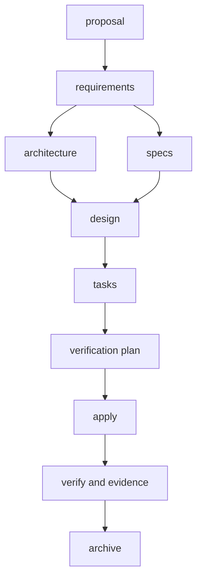

# 🏗️ OpenSpec × ISO 12207 / ISO 25010 カスタマイズ設計

## 1️⃣ 目的

OpenSpecの反復的な開発フローを維持したまま、次を一貫して管理する。

- 要求、方式、設計、実装、検証のライフサイクル
- ISO/IEC 25010の品質特性に基づく測定可能な品質要求
- 要求から検証証跡までのIDベースのトレーサビリティ
- Markdownを正本とする要件定義書と基本設計書
- Markdownから再生成できる配布用DOCX

本設計は規格の観点を開発プロセスへ組み込むものであり、規格適合や認証そのものを保証するものではない。

## 2️⃣ 設計原則

1. OpenSpecのMarkdownを正本とする。
2. ISOの観点はSchemaとTemplateへ組み込み、文書生成時だけ追加しない。
3. Wordを直接編集せず、`OpenSpec → Markdown → DOCX`の一方向で生成する。
4. 不明な情報を補完せず、`TBD`として残す。
5. Schema、文書生成、DOCX変換、検証を分離する。
6. 日常操作は`propose → apply → verify → archive`に限定する。

## 3️⃣ 全体構成

```text
openspec/
├─ config.yaml
├─ schemas/
│  └─ iso-sdlc/
│     ├─ schema.yaml
│     └─ templates/
│        ├─ proposal.md
│        ├─ requirements.md
│        ├─ architecture.md
│        ├─ spec.md
│        ├─ design.md
│        ├─ tasks.md
│        └─ verification.md
├─ changes/
│  └─ <change-name>/
│     ├─ proposal.md
│     ├─ requirements.md
│     ├─ architecture.md
│     ├─ specs/<capability>/spec.md
│     ├─ design.md
│     ├─ tasks.md
│     └─ verification.md
├─ artifacts/
│  └─ <change-name>/
│     ├─ requirements-definition/
│     │  ├─ 要件定義書.md
│     │  └─ 要件定義書.docx
│     └─ basic-design/
│        ├─ 基本設計書.md
│        └─ 基本設計書.docx
└─ document-templates/
   └─ reference.docx

.agents/skills/
├─ gen-pd/SKILL.md
└─ gen-bd/SKILL.md

scripts/openspec/
├─ validate-traceability.ps1
└─ render-docx.ps1
```

`changes/`は開発中の構造化Artifact、`artifacts/`はそこから生成した正式文書を保持する。

## 4️⃣ Artifactフロー



`verification.md`はPropose時に検証計画として生成し、Verify時に実行結果と証跡を追記する。これにより、実装後に都合のよい検証だけを選ぶことを防ぐ。

## 5️⃣ `schema.yaml`

Schema名は`iso-sdlc`とし、プロジェクトローカルに配置する。

| Artifact ID | 出力 | 依存 |
| --- | --- | --- |
| `proposal` | `proposal.md` | なし |
| `requirements` | `requirements.md` | `proposal` |
| `architecture` | `architecture.md` | `requirements` |
| `specs` | `specs/**/*.md` | `requirements` |
| `design` | `design.md` | `architecture`, `specs` |
| `tasks` | `tasks.md` | `design` |
| `verification` | `verification.md` | `tasks` |

```yaml
name: iso-sdlc
version: 1
description: ISO 12207 lifecycle viewpoints and ISO 25010 quality requirements

artifacts:
  - id: proposal
    generates: proposal.md
    description: 変更目的、範囲、Stakeholder Need
    template: proposal.md
    instruction: |
      変更理由と範囲を定義し、Stakeholder NeedへIDを付与する。
    requires: []

  - id: requirements
    generates: requirements.md
    description: 機能要求と測定可能な品質要求
    template: requirements.md
    instruction: |
      Needを要求へ具体化し、要求ごとに検証方法を定義する。
    requires: [proposal]

  - id: architecture
    generates: architecture.md
    description: 要求を満たすシステム方式
    template: architecture.md
    instruction: |
      要求と品質特性に対応する上位方式と主要判断を定義する。
    requires: [requirements]

  - id: specs
    generates: "specs/**/*.md"
    description: 外部から観測可能な振る舞いのDelta Spec
    template: spec.md
    instruction: |
      OpenSpec標準形式で検証可能な振る舞いを定義する。
    requires: [requirements]

  - id: design
    generates: design.md
    description: 方式とSpecを実装へ落とす技術設計
    template: design.md
    instruction: |
      Interface、データフロー、失敗時動作、移行、テストを設計する。
    requires: [architecture, specs]

  - id: tasks
    generates: tasks.md
    description: 追跡可能で検証可能な実装チェックリスト
    template: tasks.md
    instruction: |
      Designを依存順の実装・テスト作業へ分割する。
    requires: [design]

  - id: verification
    generates: verification.md
    description: 検証計画、実行結果、証跡
    template: verification.md
    instruction: |
      要求ごとの検証方法と期待結果を実装前に定義する。
      実行結果と証跡はVerify時に追記する。
    requires: [tasks]

apply:
  requires: [verification]
  tracks: tasks.md
  instruction: |
    要求、設計、検証計画を変更せず、Tasksに沿って実装する。
```

各Artifactの`instruction`には作成目的と判定基準だけを記述する。見出しや表などの出力形式はTemplateに置く。

## 6️⃣ Template設計

### `proposal.md`

- 変更の目的、範囲、非対象、制約、リスク
- Stakeholder Need一覧
- `NEED-NNN`の採番

### `requirements.md`

- 業務、システム、機能、外部インタフェース、データ、運用保守の要求
- `REQ-NNN`または品質要求`QR-<特性>-NNN`と親`NEED-NNN`
- 品質要求ごとのCharacteristic、Measure、Target、Conditions、Verification Method
- 受入条件と未決事項

品質特性名とID用コードはTemplate内で次に固定する。

| Code | Quality Characteristic |
| --- | --- |
| `FS` | Functional suitability |
| `PE` | Performance efficiency |
| `CO` | Compatibility |
| `IC` | Interaction capability |
| `RE` | Reliability |
| `SE` | Security |
| `MA` | Maintainability |
| `FL` | Flexibility |
| `SA` | Safety |

### `architecture.md`

- システム全体構成と主要な方式
- アプリケーション、インフラ、ネットワーク、データ、外部インタフェース
- 認証認可、セキュリティ、性能、可用性、復旧、監視、運用、リリース
- `ARCH-NNN`、対応する`REQ`または`QR`、品質特性への影響

### `spec.md`

- OpenSpec標準のDelta形式を維持する
- Requirement名へ対応する`REQ-NNN`または`QR-<特性>-NNN`を含める
- 各Requirementに検証可能なScenarioを1件以上記載する
- 内部構造や実装手順は記載しない

### `design.md`

- 方式を実装へ落とすモジュール、Interface、データフロー、エラー処理
- 互換性、移行、ロールバック、テスト戦略、代替案
- `DES-NNN`と親`ARCH-NNN`
- 重要な長期判断はADRへの参照を持たせる

### `tasks.md`

- `TASK-NNN`を持つMarkdownチェックリスト
- 各Taskから`DES`および対象`REQ`または`QR`を参照する
- 実装と対応するテストを同じ作業単位にする

### `verification.md`

- Requirement-to-Test Matrix
- 実行コマンド、期待結果、実行結果
- `TEST-NNN`と検証対象の`REQ`または`QR`
- `EVID-NNN`、証跡の保存先、取得日時
- 未検証事項、逸脱、最終判定`PASS`または`FAIL`

## 7️⃣ IDとトレーサビリティ

基本チェーンは次とする。

```text
NEED → REQ / QR → ARCH → DES → TASK → TEST → EVID
```

IDはChange内で一意とし、リポジトリ全体では`<change-name>:<ID>`を完全修飾IDとして扱う。採番済みIDは欠番になっても再利用しない。

参照はTemplateで定めた専用列へ記載し、本文中の曖昧な言及をトレーサビリティとして扱わない。多対多参照はカンマ区切りのID一覧とする。

機械的に検証するレコード形式を次に固定する。

| Artifact | レコード形式 |
| --- | --- |
| Proposal | `ID | Need | Source` |
| Requirements | `ID | Parent | Requirement | Acceptance Criteria | Verification Method` |
| Quality Requirements | `ID | Parent | Characteristic | Requirement | Measure | Target | Conditions | Verification Method` |
| Architecture | `ID | Satisfies | Decision | Quality Impact` |
| Design | `ID | Parent | Satisfies | Decision` |
| Tasks | `- [ ] TASK-NNN [DES-NNN] [REQ-NNN, QR-XX-NNN] <作業と検証方法>` |
| Tests | `ID | Verifies | Task | Method | Command | Expected | Result` |
| Evidence | `ID | Test | Path | Captured At` |

ID形式は`NEED-[0-9]{3}`、`REQ-[0-9]{3}`、`QR-(FS|PE|CO|IC|RE|SE|MA|FL|SA)-[0-9]{3}`、`ARCH-[0-9]{3}`、`DES-[0-9]{3}`、`TASK-[0-9]{3}`、`TEST-[0-9]{3}`、`EVID-[0-9]{3}`とする。

検証スクリプトは次をエラーとして扱う。

- IDの重複または形式違反
- 存在しないIDへの参照
- `NEED`から`EVID`まで到達できない要求
- `TEST`に対応する`EVID`がない状態での`PASS`
- 品質要求のMeasure、Target、Conditions、Verification Methodの欠落
- 未完了Taskまたは`TBD`が残った状態での最終`PASS`

## 8️⃣ 文書生成Skill

### 📋 `gen-pd`（要件定義）

入力は`proposal.md`、`requirements.md`、`specs/**/*.md`、`architecture.md`とする。要件定義書Markdownを生成し、ID、品質要求、受入条件、検証方法、トレーサビリティ表を保持する。

### 🏛️ `gen-bd`（基本設計）

入力は`requirements.md`、`architecture.md`、`design.md`、`specs/**/*.md`とする。基本設計書Markdownを生成し、要求と方式判断、品質要求と設計上の対策、ADR、リスク、トレーサビリティ表を保持する。

両Skillの共通規則は次とする。

- 入力Artifactにない事実を追加しない。
- 情報不足は`TBD`として出力する。
- 元のIDを変更しない。
- 出力先を`openspec/artifacts/<change-name>/`配下に限定する。
- 同じ入力から同じ章立てを再生成できるようにする。

## 9️⃣ DOCX Renderer

`render-docx.ps1`はMarkdownからDOCXを作るだけのModuleとし、ISOやOpenSpecの意味判断を持たせない。

```powershell
# Markdownをreference.docxの書式でDOCXへ変換する。
.\scripts\openspec\render-docx.ps1 `
  -InputPath '<document.md>' `
  -OutputPath '<document.docx>' `
  -ReferenceDoc 'openspec\document-templates\reference.docx'
```

内部ではPandocと`reference.docx`を使用する。Markdown生成とDOCX変換を分離し、書式変更がSchemaや文書内容へ影響しないようにする。

## 🔟 VerifyとArchiveの制御

`/opsx:verify`では次を実行する。

1. テスト、Lint、型検査などTasksで指定した検証を実行する。
2. `validate-traceability.ps1`を実行する。
3. `verification.md`へ実行結果、`TEST`、`EVID`、判定を記録する。
4. 2つの文書生成Skillを実行する。
5. MarkdownからDOCXを生成する。

OpenSpec標準のVerifyは結果を報告するが、Archiveを強制停止しない。そのため、CIでもトレーサビリティ検証を実行し、終了コードが非0または`verification.md`が`FAIL`の場合はマージを失敗させる。ArchiveはCI成功後に行う。

## 1️⃣1️⃣ Git管理

管理対象:

```text
openspec/config.yaml
openspec/schemas/**
openspec/changes/**
openspec/artifacts/**/*.md
openspec/document-templates/reference.docx
.agents/skills/gen-pd/**
.agents/skills/gen-bd/**
scripts/openspec/**
```

`.gitignore`へ次を追加する。

```gitignore
openspec/artifacts/**/*.docx
```

## 1️⃣2️⃣ 実装順序

1. `spec-driven`を`iso-sdlc`へForkし、標準Spec形式を保持する。
2. `schema.yaml`と7つのTemplateを実装する。
3. `openspec/config.yaml`の既定Schemaを`iso-sdlc`へ変更する。
4. トレーサビリティ検証スクリプトを実装する。
5. 2つの文書生成Skillを実装する。
6. PandocによるDOCX Rendererと`reference.docx`を追加する。
7. サンプルChangeで`propose → apply → verify → archive`を通す。
8. CIへSchema、Change、トレーサビリティの検証を追加する。

## 1️⃣3️⃣ 受入条件

- `openspec schema validate iso-sdlc`が成功する。
- Proposeで7つのArtifactが依存順に生成される。
- すべての品質要求にCharacteristic、Measure、Target、Conditions、Verification Methodがある。
- `NEED → REQ / QR → ARCH → DES → TASK → TEST → EVID`を機械的に追跡できる。
- 欠落参照、証跡なしのPASS、未完了Task、残存TBDを検出できる。
- Verifyで`verification.md`、2つの正式Markdown、2つのDOCXが生成される。
- 正式MarkdownだけがGit管理され、生成DOCXはGit管理外である。
- Archive後もChange、正式Markdown、検証証跡の対応を追跡できる。

## References

- [OpenSpec Customization](https://github.com/Fission-AI/OpenSpec/blob/main/docs/customization.md)
- [OpenSpec Commands](https://github.com/Fission-AI/OpenSpec/blob/main/docs/commands.md)
